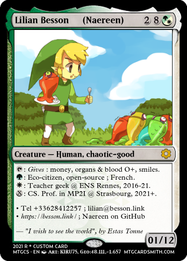

# Business Card - as a Magic© card (fun experiment)

For April's fool in 2021, I got a fun but stupid idea: what if I used an original format for my future business card, using a fake [Magic the Gathering](https://en.wikipedia.org/wiki/Magic:_The_Gathering) card, to present myself and give my contact information as well as profile picture? [More details?](experimental-Magic-cards/)

Here is the design I liked the most, after about 25 different designs I tried as prototypes of business card for [myself](https://GitHub.com/Naereen):



And in French:


----

# Business Card - in LaTeX
> Forked from [@JillJenn/Business-Card](https://GitHub.com/JillJenn/Business-Card).

TL;DR: this repo contains a [LaTeX file](card.tex) that get compiled to give PDF and PNG business cards!
For [me](https://GitHub.com/Naereen), it currently looks like this:


Feel free to fork the repo, change and adapt the [card](card.tex) file to suits your need, and use it! ([AGPLv3 licensed](https://www.gnu.org/licenses/agpl-3.0.en.html))

----

## Requirements
- [XeLaTeX](https://en.wikipedia.org/wiki/XeTeX)
- Logo of your institutions

## Build
The simplest way is to just compile the `card.tex` file to the `card.pdf` file:
```bash
xelatex card
```
Or by using [the Makefile](Makefile), which compiles to PDF, then convert to GIF and PNG, and cleans temporary files:
```bash
make
```

## License?
[AGPLv3](https://www.gnu.org/licenses/agpl-3.0.en.html) because « the original author likes to force people to be free ».

© 2017 [Jill-Jênn Vie](https://GitHub.com/JillJenn/business-card), adapted by [Lilian Besson](https://GitHub.com/Naereen/Business-Card).

> *Note:* of course, I do not have any property rights on the logo used for my business card, of [CentraleSupélec](cslogo.png) and [Inria Lille](inrialogo.png).
