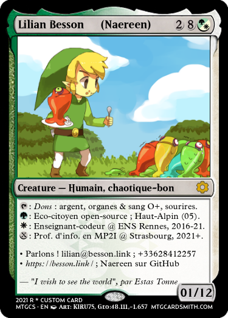

# Experiments - using a fake Magic card for a business card?

For April's fool in 2021, I got a fun but stupid idea: what if I used an original format for my future business card, using a fake [Magic the Gathering](https://en.wikipedia.org/wiki/Magic:_The_Gathering) card, to present myself and give my contact information as well as profile picture?

## How to design one?

There are a few websites online where you can design your own Magic the Gathering card, here are the two I tried and used:

- https://www.mtgcardmaker.com/
- https://mtgcardsmith.com/ (example: https://mtgcardsmith.com/preview?img=1617310515306586&t=278976) 

## How to print it?

### First idea: trully home-made

Use a high-quality color printer, print to correct size on a regular paper, and use some school glue to stick your card to a real Magic card (preferably a forest, to remember people that these are essential for our survival!) ;

TODO: try!

### Rich kid idea: a website that prints business card

I think it is the laziest solution, but also not a good one: it will be expensive (e.g., 16€ for 100 cards on [VistaPrint](https://www.vistaprint.fr/cartes-de-visite)), the cards won't have the correct size, they won't have a true Magic back, etc.
Also, it's not so ecological to order 100 when you will need only a few. 

----

## My own business card as a Magic© card

Here is the design I liked the most, after about 25 different designs I tried as prototypes of business card for [myself](https://GitHub.com/Naereen):

----

## Are you serious?

Not yet. Soon.

## Does it work?

I guess so.

## How does people react to this?

Let's find out.